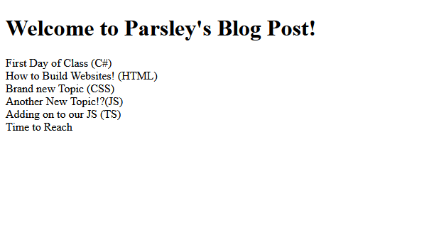

# JavaScript Assignment - Blog Post

This assignment is meant to challenge my understanding of DOM manipulation, understanding of template literal, and he use of a for ... of loop, instantiation of an object or object(s) of a class, adding elements to an array, loop through (iterate through) an array, and use of ES6 standards.

## Approach

- A class `Article` which contains a constructor and an output method created. 
- An array was created with stores the `Article` objects.
- Recreate the blog post using a loop. 

## Result

The working webpage can be shown [here](https://jia-von.github.io/javascript-blog-assignment/).

### Screenshot

#### Note

There are still issues with this assginment. It will be fixed when time is available.

## References:

Morelli, 2020. JavaScript -- What are Template Literals. Learn and Understand How to Use Template Literals. URL: https://codeburst.io/javascript-what-are-template-literals-5d08a50ef2e3. Date Accessed July 23, 2020.

MDN web docs, 2020. The Article Contents element. URL: https://developer.mozilla.org/en-US/docs/Web/HTML/Element/article. Date Accessed July 22, 2020.

MDN web docs, 2020. ParentNode.append(). URL: https://developer.mozilla.org/en-US/docs/Web/API/ParentNode/append. Date Accessed July 22, 2020.

Ulrich, 2020. 4.1-javascript-objects, authored by Warren Ulrich on July 22, 2020. URL: https://github.com/TECHCareers-by-Manpower/4.1-javascript-objects. Accessed on July 22, 2020.